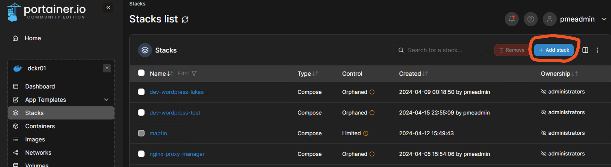
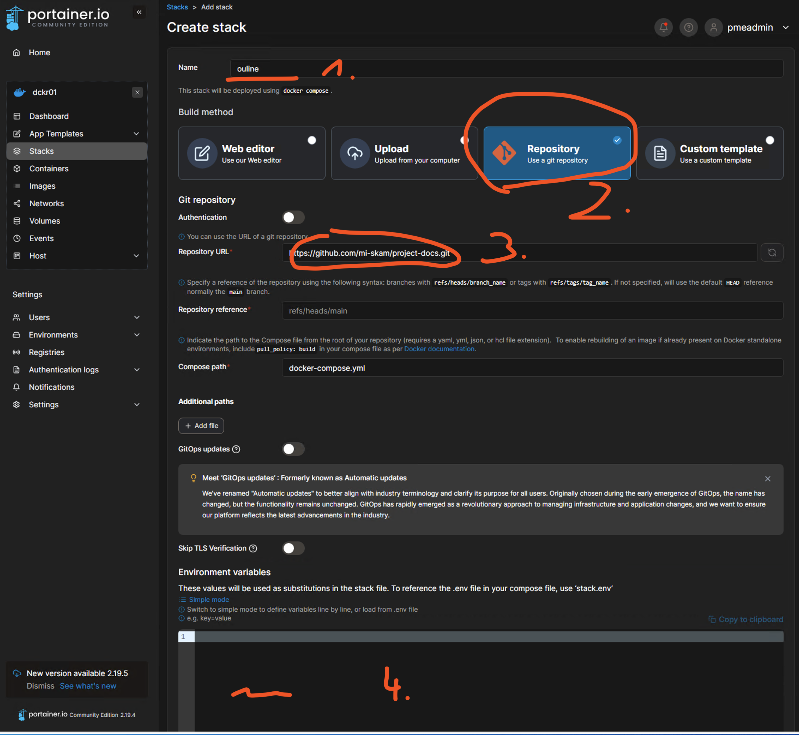

# Evaluation von **keycloak** für PME

## Konfiguration

ein Beispiel findest du hier [stack.EXAMPLE.env](./stack.EXAMPLE.env)

| Variable                | Wert             | Beschreibung                         |
| ----------------------- | ---------------- | ------------------------------------ |
| KEYCLOAK_ADMIN          | admin            | Admin User                           |
| KEYCLOAK_ADMIN_PASSWORD | admin.1234       | Admin Password                       |
| POSTGRES_DB             | keycloak-db      | Postgres DB for Keycloak             |
| POSTGRES_USER           | keycloak-db-user | Postgres User for Keycloak           |
| POSTGRES_PASSWORD       | db-user.1234     | Postgress User password for Keycloak |

## Lokale Dev-Umgebung

Dieses Repository enthält eine `.devcontainer` Konfiguration und einem
Docker-Compose-File (nicht zu verwechseln mit der docker-composee.yml im
root-Verzeichnis, die für das Deployment gedacht ist), welches einen
**devcontainer** und eine lokale **keycloak** Instanz bereit hält.

### Voraussetzungen

- Docker (for Desktop)
- VSCode
- Dev Continer Extension für VSCode (ms-vscode-remote.remote-containers)

Wenn die Extension installiert ist, wird man gefragt, ob das Projekt in einem
Devcontainer neu geöffnet werden soll und das bejaht man dann. Falls man diese
Frage nicht sieht, oder verpasst hat, kann man die Befehlszeile von VSCode

nutzen und mit `"Dev Containers: Rebuild and reopen in Container"` das von Hand anstoßen.

Jetzt befinden wir uns in einer Linux-Umgebung und Keycloack lauscht auf `8080` auf der dev-Maschine.

Die Daten der `DB` werden im `./data` Ordner persistiert.

Custom themes können nach `./themes` kopiert werden.  

## Deployment für das Produktivsystem

### Voraussetzungen

- Docker
- Portainer

Wir loggen uns auf der Portainer ein und fügen einen neuen **Stack** hinzu. Die
Stack-Definition besteht aus zwei Komponenten:

- Docker Compose file (`docker-compose.yml`)
- Umgebungsvariablen (`stack.env`)

_In dem Repository kann die `stack.env` nicht liegen, da sich in ihr Secrets und
Passwörter befinden und dieses Repo hier public ist und es generell keine gute
Praxis ist, diese mit zu committen._

- Wir legen einen Stack an und vergeben einen Namen
- Kopieren das docker compose file und die stack.env von Hand rein oder laden
  die Umgebung via Repository (Punkt 2 und 3).
- Dann kümmern wir uns um die Umgebungsvariablen, die wir per Datei hochladen
  oder reinkopieren (Punkt 4.)

### Portainer-Besonderheit

Der Name `stack.env` in der `env_file` Direktive führt **automatisch** dazu,
dass die Umgebungsvariablen die in Portainer definiert werden, dem jeweiligen
Container bekannt gemacht werden.

Lässt man diese weg, muss man händisch die docker-compose `environment` Syntax
für jede Variable und jeden Container gebrauchen.:

```yaml
services:
  container:
    environment:
      variable: { variable }
```



